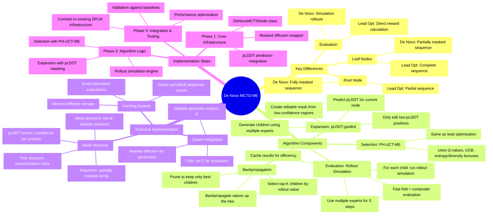

# De Novo MCTD-ME Implementation Mindmap

## 🎯 Core Concept: From Lead Optimization to De Novo Generation



## 📋 Detailed Implementation Plan

### 1. **Key Algorithmic Differences Analysis**

| Component | Lead Optimization | De Novo Generation |
|-----------|------------------|-------------------|
| **Root Node** | Partially complete sequence | Fully masked sequence (length L) |
| **Leaf Nodes** | Complete sequences | Partially masked sequences |
| **Expansion** | Direct generation | pLDDT → mask → generate |
| **Evaluation** | Direct reward calc | Rollout simulation |
| **Tree Depth** | Shallow (few iterations) | Deeper (more masking steps) |

### 2. **Node Structure Design**

```python
@dataclass
class DeNovoMCTSNode:
    sequence: str                    # Partially masked sequence
    mask_positions: Set[int]         # Positions available for editing
    plddt_scores: np.ndarray        # Confidence scores per position
    coordinates: np.ndarray         # 3D structure coordinates
    
    # MCTS tree structure
    parent: 'DeNovoMCTSNode'
    children: List['DeNovoMCTSNode']
    
    # MCTS statistics
    visit_count: int
    total_value: float
    reward_cache: float
    
    # pH-UCT-ME bonuses
    entropy_bonus: float
    diversity_bonus: float
```

### 3. **Core Algorithm Flow**

```python
def denovo_mctd_me(root_mask_seq, experts, critics, T_simulations):
    """
    De Novo MCTD-ME Algorithm Implementation
    
    Args:
        root_mask_seq: Fully masked sequence of length L
        experts: List of generator experts {policy^1, ..., policy^E}
        critics: Structure/biophysics surrogate models
        T_simulations: Total number of simulations
    """
    
    # Initialize root node (fully masked)
    root = DeNovoMCTSNode(
        sequence=root_mask_seq,
        mask_positions=set(range(len(root_mask_seq))),
        plddt_scores=np.zeros(len(root_mask_seq))
    )
    
    for simulation in range(T_simulations):
        # 1. Selection via PH-UCT-ME
        node = select_leaf_node(root)
        
        # 2. Expansion with pLDDT masking
        children = expand_with_plddt_masking(node, experts)
        
        # 3. Evaluation via rollout simulation
        for child in children:
            child.reward_cache = rollout_simulation(child, experts, critics)
        
        # 4. Keep top-K children and backpropagate
        top_children = select_top_k(children, K=3)
        node.children = top_children
        backpropagate_values(top_children)
    
    return extract_best_sequences(root)
```

### 4. **Critical Implementation Components**

#### A. **pLDDT-Based Expansion**
```python
def expand_with_plddt_masking(node, experts):
    """
    Expansion step with pLDDT-guided masking
    """
    # 1. Predict pLDDT for current sequence
    plddt_scores = predict_plddt(node.sequence)
    
    # 2. Create editable mask (low confidence = editable)
    editable_mask = create_editable_mask(plddt_scores, threshold=70)
    
    # 3. Generate children using multiple experts
    children = []
    for expert in experts:
        child_seq = masked_diffusion(node.sequence, editable_mask, expert)
        child = create_child_node(child_seq, node, editable_mask)
        children.append(child)
    
    return children
```

#### B. **Rollout Simulation**
```python
def rollout_simulation(node, experts, critics, S_steps=5):
    """
    Simulation-based evaluation with expert rollouts
    """
    current_seq = node.sequence
    
    # Perform S rollout steps
    for step in range(S_steps):
        # Select random expert
        expert = random.choice(experts)
        
        # Generate next step with masked diffusion
        mask = get_remaining_mask_positions(current_seq)
        if not mask:
            break  # Fully unmasked
        
        current_seq = masked_diffusion(current_seq, mask, expert)
    
    # Fast fold + composite evaluation
    coords = fast_fold(current_seq)
    reward = evaluate_composite(current_seq, coords, critics)
    
    return reward
```

#### C. **Masked Diffusion Integration**
```python
def masked_diffusion(sequence, mask_positions, expert):
    """
    Generate new sequence using masked diffusion
    """
    # Create masked input
    masked_seq = apply_mask(sequence, mask_positions)
    
    # Generate using expert model
    if expert.model_type == "dplm":
        return expert.generate_from_masked(masked_seq)
    elif expert.model_type == "proteina":
        return expert.generate_conditional(masked_seq, mask_positions)
    elif expert.model_type == "rfdiffusion":
        return expert.inpaint_sequence(masked_seq, mask_positions)
    else:
        raise ValueError(f"Unknown expert type: {expert.model_type}")
```

### 5. **Integration Points with Existing Code**

#### A. **Reuse from Current MCTS**
- `PH-UCT-ME selection logic` from `motif_scaffolding_mcts.py`
- `Expert integration` from `mcts_compatible_experts.py`
- `Evaluation infrastructure` from existing reward calculation

#### B. **New Components Needed**
- `DeNovoMCTSNode` class (extends current `MCTSNode`)
- `pLDDT prediction` integration (ESMFold or similar)
- `Masked diffusion` wrapper for multiple expert types
- `Rollout simulation` engine

#### C. **Modified Components**
- `Expansion strategy` (pLDDT-based instead of direct generation)
- `Evaluation method` (simulation instead of direct calculation)
- `Tree structure` (deeper trees for gradual unmasking)

### 6. **Performance Considerations**

#### A. **Caching Strategy**
```python
class DeNovoCache:
    """Efficient caching for de novo generation"""
    
    def __init__(self):
        self.sequence_cache = {}      # sequence -> reward
        self.plddt_cache = {}        # sequence -> plddt_scores
        self.structure_cache = {}     # sequence -> coordinates
    
    def get_cached_reward(self, sequence):
        return self.sequence_cache.get(sequence)
    
    def cache_evaluation(self, sequence, reward, plddt, coords):
        self.sequence_cache[sequence] = reward
        self.plddt_cache[sequence] = plddt
        self.structure_cache[sequence] = coords
```

#### B. **Memory Management**
- Limit tree depth to prevent memory explosion
- Prune unpromising branches early
- Use efficient data structures for mask representation

#### C. **Computational Optimization**
- Batch pLDDT predictions when possible
- Reuse structure predictions across similar sequences
- Parallel rollout simulations for different children

### 7. **Testing & Validation Strategy**

#### A. **Unit Tests**
- `DeNovoMCTSNode` functionality
- `pLDDT masking` logic
- `Masked diffusion` integration
- `Rollout simulation` correctness

#### B. **Integration Tests**
- End-to-end de novo generation
- Comparison with baseline methods
- Performance benchmarking

#### C. **Scientific Validation**
- Compare against pure sampling methods
- Validate on known protein design tasks
- Analyze convergence properties

## 🚀 Implementation Priority

1. **High Priority** (Core Algorithm)
   - DeNovoMCTSNode class
   - pLDDT prediction integration
   - Basic rollout simulation
   - Masked diffusion wrapper

2. **Medium Priority** (Optimization)
   - Caching system
   - Performance optimization
   - Advanced rollout strategies

3. **Low Priority** (Enhancement)
   - Advanced masking strategies
   - Multi-objective optimization
   - Visualization tools

## 📊 Expected Outcomes

- **Better exploration** of sequence space through gradual unmasking
- **Higher quality** sequences through pLDDT-guided generation
- **More robust** evaluation through simulation rollouts
- **Scalable** approach for longer sequences and complex targets

This mindmap provides a comprehensive roadmap for implementing the de novo MCTD-ME algorithm while building on the existing MCTS infrastructure.
